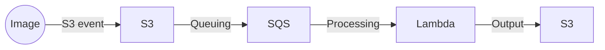

# Image Processing Architecture Sample
This is a serverless image processing architecture sample.

## Architeture


## Setup
Install dependencies
```bash
npm install
```
Build assets
```bash
npm run build
```

## Tool
Test function
```bash
npm run testf
```
Update Snapshot
```bash
npm run testu
```
Precommit
```bash
npm run pc
```
